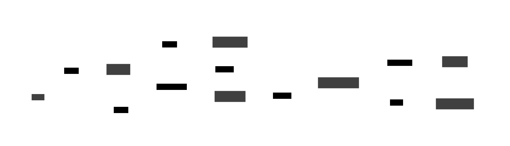
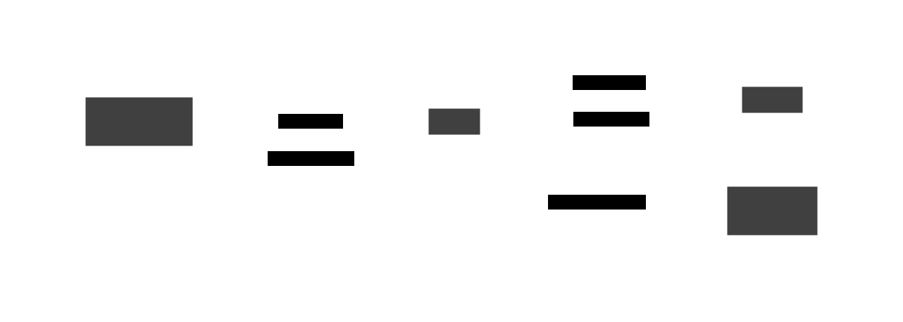

# Scalable SAAS Solutions: Technical Briefing

**Date:** June 8, 2025  
**Subject:** Best Practices for Building Scalable SAAS Solutions with Open Source Technologies  
**Focus:** Vercel, Supabase, and Cross-Client Synchronization Strategies

---

## Executive Summary

This technical briefing outlines best practices for developing scalable Software-as-a-Service (SAAS) solutions using modern open-source technologies, with particular emphasis on Vercel for deployment/hosting and Supabase for backend services. The architecture prioritizes cross-client compatibility, allowing users to seamlessly switch between web and mobile clients while maintaining synchronized state and data consistency.

### Key Recommendations

- **Frontend**: Next.js with React for web, React Native for mobile
- **Backend**: Supabase (open-source Firebase alternative)
- **Deployment**: Vercel for frontend, self-hosted or Supabase cloud for backend
- **State Management**: Real-time synchronization with optimistic updates
- **Database**: PostgreSQL with real-time subscriptions

---

## Technology Stack Overview

### Core Technologies

#### Frontend Technologies
- **Web Client**: Next.js 14+ with App Router
- **Mobile Client**: React Native with Expo
- **State Management**: Zustand + React Query/TanStack Query
- **UI Framework**: Tailwind CSS with headless UI components

#### Backend Technologies
- **Database**: PostgreSQL (via Supabase)
- **API**: RESTful + GraphQL endpoints
- **Real-time**: WebSocket connections for live updates
- **Authentication**: Supabase Auth with social providers
- **File Storage**: Supabase Storage or S3-compatible

#### Deployment & Infrastructure
- **Frontend Hosting**: Vercel (web), App stores (mobile)
- **Backend Hosting**: Supabase Cloud or self-hosted
- **CDN**: Vercel Edge Network
- **Monitoring**: Sentry, LogRocket, or open-source alternatives

### Open Source Alternatives

| Component | Primary Choice | Open Source Alternative |
|-----------|---------------|-------------------------|
| Hosting | Vercel | Netlify, Railway, self-hosted |
| Backend | Supabase | Directus, Strapi, Pocketbase |
| Database | PostgreSQL | PostgreSQL, CockroachDB |
| Auth | Supabase Auth | Ory, Auth0 (OSS), NextAuth.js |
| Storage | Supabase Storage | MinIO, SeaweedFS |
| Monitoring | Sentry | Glitchtip, Uptime Kuma |

---

## Architectural Patterns

### 1. Multi-Client Architecture

The architecture supports multiple client types accessing the same backend services:

```
Web Client (Next.js) ────┐
                         ├─── Supabase Backend ─── PostgreSQL
Mobile Client (RN) ──────┘
```

### 2. Data Synchronization Strategy

#### Real-time Synchronization
- WebSocket connections for instant updates
- Optimistic UI updates with rollback capability
- Conflict resolution for concurrent edits
- Offline-first approach with sync when online

#### Synchronization Flow
1. **Client Action**: User performs action on any client
2. **Optimistic Update**: UI updates immediately
3. **API Call**: Change sent to Supabase
4. **Real-time Broadcast**: All connected clients receive update
5. **Conflict Resolution**: Handle any conflicts automatically

### 3. Authentication & Authorization

#### Multi-Device Authentication
- JWT tokens with refresh token rotation
- Device fingerprinting for security
- Social login providers (Google, GitHub, Apple)
- Multi-factor authentication support

#### Session Management
- Cross-device session persistence
- Automatic token refresh
- Secure logout from all devices

---

## Cross-Client Synchronization Strategies

### 1. Real-time Data Synchronization

#### Implementation with Supabase Realtime
```javascript
// Subscribe to real-time changes
const subscription = supabase
  .channel('room1')
  .on('postgres_changes', { 
    event: '*', 
    schema: 'public', 
    table: 'documents' 
  }, payload => {
    // Update local state
    updateLocalData(payload);
  })
  .subscribe();
```

#### State Management Pattern
- **Single Source of Truth**: Database as the authoritative source
- **Optimistic Updates**: UI updates before server confirmation
- **Conflict Resolution**: Last-write-wins or operational transform
- **Offline Persistence**: Local storage with sync queue

### 2. Cross-Platform State Management

#### Shared State Architecture
```javascript
// Zustand store for cross-client state
const useAppStore = create((set, get) => ({
  user: null,
  documents: [],
  syncStatus: 'connected',
  
  updateDocument: (id, changes) => {
    // Optimistic update
    set(state => ({
      documents: state.documents.map(doc => 
        doc.id === id ? { ...doc, ...changes } : doc
      )
    }));
    
    // Sync to server
    syncDocumentChanges(id, changes);
  }
}));
```

### 3. Offline-First Strategy

#### Progressive Web App (PWA) Features
- Service worker for caching
- Background sync for offline changes
- Push notifications for updates
- Installable web app

#### Mobile Offline Support
- SQLite local database
- Sync queue for pending operations
- Conflict resolution on reconnection

---

## Best Practices

### 1. Performance Optimization

#### Frontend Performance
- **Code Splitting**: Route-based and component-based splitting
- **Image Optimization**: Next.js Image component with Vercel optimization
- **Caching Strategy**: SWR/React Query for smart caching
- **Bundle Analysis**: Regular bundle size monitoring

#### Backend Performance
- **Database Indexing**: Proper PostgreSQL indexes
- **Query Optimization**: Use Supabase query builder efficiently
- **Connection Pooling**: PgBouncer for database connections
- **Caching Layer**: Redis for frequently accessed data

### 2. Security Best Practices

#### Data Protection
- **Row Level Security (RLS)**: PostgreSQL RLS policies
- **API Security**: Rate limiting and input validation
- **HTTPS Everywhere**: End-to-end encryption
- **Audit Logging**: Track all data modifications

#### Authentication Security
- **Secure Token Storage**: Platform-specific secure storage
- **Token Validation**: Server-side token verification
- **CORS Configuration**: Proper cross-origin settings
- **SQL Injection Prevention**: Parameterized queries

### 3. Scalability Considerations

#### Horizontal Scaling
- **Microservices Architecture**: Separate services for distinct features
- **Database Sharding**: Partition data across multiple databases
- **CDN Usage**: Global content distribution
- **Load Balancing**: Multiple application instances

#### Vertical Scaling
- **Database Optimization**: Query performance tuning
- **Memory Management**: Efficient state management
- **CPU Optimization**: Minimize computational overhead

---

## Implementation Guidelines

### 1. Project Structure

```
saas-app/
├── apps/
│   ├── web/                 # Next.js web application
│   ├── mobile/              # React Native mobile app
│   └── admin/               # Admin dashboard
├── packages/
│   ├── shared/              # Shared utilities and types
│   ├── ui/                  # Shared UI components
│   └── database/            # Database schemas and migrations
├── supabase/
│   ├── migrations/          # Database migrations
│   ├── functions/           # Edge functions
│   └── config.toml          # Supabase configuration
└── deployment/
    ├── docker/              # Docker configurations
    └── k8s/                 # Kubernetes manifests
```

### 2. Development Workflow

#### Environment Setup
1. **Local Development**: Supabase CLI for local backend
2. **Staging Environment**: Vercel preview deployments
3. **Production**: Vercel production with Supabase cloud
4. **Testing**: Automated testing with CI/CD

#### CI/CD Pipeline
- **Code Quality**: ESLint, Prettier, TypeScript
- **Testing**: Unit tests, integration tests, E2E tests
- **Security Scanning**: Dependency vulnerability checks
- **Performance Monitoring**: Lighthouse CI, bundle analysis

### 3. Monitoring and Observability

#### Application Monitoring
- **Error Tracking**: Sentry for error monitoring
- **Performance**: Web Vitals tracking
- **User Analytics**: Privacy-focused analytics
- **Uptime Monitoring**: Service availability checks

#### Infrastructure Monitoring
- **Database Performance**: Supabase built-in monitoring
- **API Performance**: Response time tracking
- **Resource Usage**: Memory and CPU monitoring
- **Cost Optimization**: Usage-based cost tracking

---

## Architecture Diagrams

### High-Level System Architecture



*Figure 1: High-level system architecture showing the relationship between user clients, hosting infrastructure, and backend services.*

### Data Synchronization Flow



*Figure 2: Real-time data synchronization flow between multiple clients through Supabase Realtime, demonstrating optimistic updates and conflict resolution.*

### Authentication & Security Architecture


*Figure 3: Authentication and security architecture showing multi-device authentication flow with external OAuth providers and Row-Level Security implementation.*

---

## Cost Optimization Strategies

### 1. Tiered Architecture Approach

#### Starter Tier (MVP)
- **Frontend**: Vercel Hobby plan
- **Backend**: Supabase Free tier
- **Estimated Cost**: $0-20/month
- **Suitable for**: Proof of concept, early testing

#### Growth Tier (Scale-up)
- **Frontend**: Vercel Pro plan
- **Backend**: Supabase Pro plan
- **CDN**: Vercel Edge Network
- **Estimated Cost**: $100-500/month
- **Suitable for**: Growing user base, production workloads

#### Enterprise Tier (Large Scale)
- **Frontend**: Vercel Enterprise
- **Backend**: Self-hosted Supabase or Enterprise
- **Infrastructure**: Kubernetes cluster
- **Estimated Cost**: $1000+/month
- **Suitable for**: Large organizations, compliance requirements

### 2. Open Source Alternatives for Cost Reduction

#### Self-Hosted Stack
- **Hosting**: Railway, DigitalOcean, or AWS
- **Backend**: Self-hosted Supabase
- **Database**: Managed PostgreSQL
- **Total Savings**: 40-60% compared to managed services

---

## Migration and Deployment Strategy

### 1. Phased Rollout

#### Phase 1: Core MVP
- Basic CRUD operations
- User authentication
- Single client (web or mobile)

#### Phase 2: Multi-Client Support
- Add second client platform
- Implement real-time synchronization
- Cross-device authentication

#### Phase 3: Advanced Features
- Offline support
- Advanced collaboration features
- Performance optimizations

### 2. Risk Mitigation

#### Technical Risks
- **Vendor Lock-in**: Use open-source alternatives where possible
- **Data Migration**: Plan for easy data export/import
- **Performance Bottlenecks**: Monitor and optimize continuously
- **Security Vulnerabilities**: Regular security audits

#### Business Risks
- **Cost Escalation**: Monitor usage and optimize regularly
- **Compliance**: Ensure GDPR, CCPA compliance from start
- **Scalability**: Design for growth from day one

---

## Conclusion

Building scalable SAAS solutions with Vercel and Supabase provides a powerful foundation for modern applications. The open-source nature of the core technologies reduces vendor lock-in while providing enterprise-grade capabilities. The key to success lies in:

1. **Progressive Enhancement**: Start simple, add complexity gradually
2. **Performance First**: Optimize for speed and efficiency
3. **Security by Design**: Implement security from the ground up
4. **User Experience**: Seamless cross-client experience
5. **Cost Optimization**: Balance features with cost efficiency

The architecture outlined in this briefing supports both rapid development and long-term scalability, making it suitable for startups through enterprise applications.

---

**Next Steps:**
1. Set up development environment with Supabase CLI
2. Create proof-of-concept with basic CRUD operations
3. Implement authentication and real-time features
4. Deploy to Vercel with CI/CD pipeline
5. Monitor performance and iterate based on user feedback