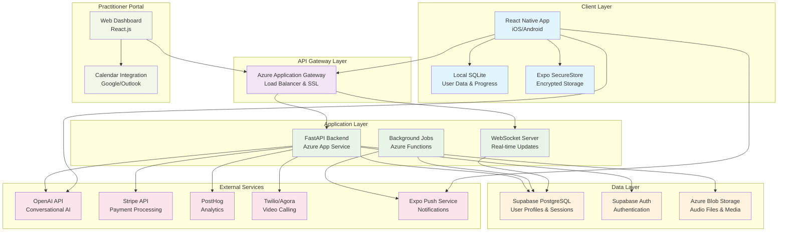

# Breath Work Companion App - Technical Architecture

## Launch Features (MVP)

### Conversational AI Onboarding
Intelligent chat-based user onboarding that captures name, experience level, and preferences through natural conversation flow. The AI personalizes the experience from the first interaction and establishes user comfort with the app's conversational approach.

* Natural language processing for user input understanding
* Dynamic conversation flow based on user responses
* Experience level assessment (beginner vs experienced)
* Preference capture for session timing and goals
* Local storage of onboarding data for privacy

#### Tech Involved
* OpenAI GPT API for conversational intelligence
* React Native chat UI components
* Local SQLite database via Expo SQLite
* Async Storage for session persistence

#### Main Requirements
* Offline capability after initial setup
* Sub-3-second response times for AI interactions
* Secure local data encryption
* Graceful handling of network interruptions

### AI-Guided Breathing Sessions
Core 3-minute breathing exercises with real-time AI coaching that adapts to user behavior and provides personalized guidance throughout the session. Features dynamic body check-ins and breathing pattern adjustments.

* 5-second inhale, 5-second exhale rhythm guidance
* Real-time session adaptation based on user feedback
* Background soundscapes for relaxation
* Mid-session body awareness prompts
* Session completion tracking and metrics

#### Tech Involved
* React Native audio playback with Expo AV
* Real-time timer management with precise intervals
* OpenAI API for dynamic coaching responses
* Local audio file management for offline playback
* Device haptic feedback integration

#### Main Requirements
* Precise timing accuracy (±100ms)
* Uninterrupted audio playback
* Low latency AI response generation
* Graceful degradation without network

### Progress Tracking & Gamification
Comprehensive progress system that tracks daily streaks, session completions, and user improvements over time. Includes badge system and achievement unlocks to encourage consistent daily practice.

* Daily streak counter with persistence
* Badge system for milestones
* Session history and completion metrics
* Visual progress indicators and charts
* Achievement notifications

#### Tech Involved
* Local SQLite database for progress storage
* React Native Charts library for visualizations
* Push notification system via Expo Notifications
* Background task scheduling for streak maintenance

#### Main Requirements
* Reliable offline progress tracking
* Cross-device sync capability (future)
* Performance optimization for large datasets
* Privacy-compliant analytics integration

### Smart Notification System
Intelligent reminder system that learns user patterns and sends personalized notifications at optimal times to encourage daily practice without being intrusive.

* Customizable reminder timing (morning/evening)
* Smart notification scheduling based on usage patterns
* Progressive reminder strategy for lapsed users
* App badge updates for session availability

#### Tech Involved
* Expo Notifications for cross-platform push notifications
* Background task scheduling
* Local notification management
* PostHog analytics for notification effectiveness

#### Main Requirements
* Reliable notification delivery across platforms
* Battery-efficient background processing
* User-controlled notification preferences
* Compliance with platform notification guidelines

### Practitioner Discovery & Booking
Marketplace-style interface for discovering and booking sessions with certified breath work practitioners. Includes practitioner profiles, availability management, and integrated video calling.

* Practitioner profile browsing with filters
* Real-time availability viewing
* Integrated booking system with calendar sync
* Secure video calling integration
* Payment processing for sessions

#### Tech Involved
* Supabase backend for practitioner data management
* Stripe payment processing integration
* Calendar API integration (iOS/Android)
* WebRTC for video calling (Agora/Twilio)
* Real-time updates via Supabase subscriptions

#### Main Requirements
* HIPAA-compliant video sessions
* Reliable payment processing
* Seamless calendar integration
* High-quality video/audio streaming

## Future Features (Post-MVP)

### Advanced Breathing Techniques Library
Expanded library of breathing techniques beyond basic 4-7-8 pattern, including specialized methods for anxiety, focus, sleep, and energy.

* Box breathing, triangle breathing, and custom patterns
* Technique recommendations based on user goals
* Progressive difficulty levels
* Integration with biometric devices

#### Tech Involved
* Advanced timing algorithms for complex patterns
* Health kit integration (iOS) / Google Fit (Android)
* Machine learning for personalized recommendations
* Expanded audio library with spatial audio

#### Main Requirements
* Real-time biometric data processing
* Complex pattern timing accuracy
* Scalable recommendation engine
* Multi-language audio content

### Social Community Features
Community platform for users to share progress, participate in group challenges, and connect with others on similar wellness journeys.

* Group breathing sessions with synchronized timing
* Progress sharing and social challenges
* Community forums and discussion groups
* Practitioner-led group sessions

#### Tech Involved
* Real-time synchronization service
* Social feed management system
* WebSocket connections for live sessions
* Content moderation and safety systems

#### Main Requirements
* Real-time synchronization for group sessions
* Scalable social feed architecture
* Content moderation and safety features
* Privacy controls for sharing

### AI Health Insights & Recommendations
Advanced AI analytics that provide personalized health insights based on breathing patterns, session frequency, and reported wellness outcomes.

* Breathing pattern analysis and improvement suggestions
* Wellness trend identification
* Personalized session recommendations
* Integration with wearable device data

#### Tech Involved
* Machine learning pipeline for pattern analysis
* Advanced analytics database (PostgreSQL with TimescaleDB)
* Real-time data processing with Apache Kafka
* Predictive modeling for health outcomes

#### Main Requirements
* HIPAA compliance for health data
* Real-time analytics processing
* Scalable ML pipeline architecture
* Privacy-preserving analytics methods

## System Diagram

## Questions & Clarifications

* How do you envision the AI coaching to evolve during a session - should it respond to user input/feedback or follow a predetermined script with variations?
* What level of offline functionality is required - should users be able to complete full sessions without any internet connection?
* For practitioner discovery, do you want to integrate with existing practitioner directories or build a proprietary network?
* What are your specific privacy requirements beyond local-first storage - do you need HIPAA compliance for health data?
* How do you want to handle user authentication if data is primarily local - anonymous usage or account-based with cloud backup?
* What's your preferred approach for handling app updates that might affect locally stored AI models or session data?
* Do you want to support multiple breathing techniques in MVP or focus solely on the 5-second inhale/exhale pattern?
* How should the app handle interruptions during sessions (calls, notifications, app backgrounding)?

## List of Architecture Consideration Questions

* How will you handle data synchronization across multiple devices while maintaining local-first privacy principles?
* What's your strategy for scaling the OpenAI API costs as you approach 100K users with frequent AI interactions?
* How will you implement efficient caching strategies for AI responses to reduce latency and API costs?
* What's your approach to handling different platform-specific features (iOS vs Android) while maintaining code reuse?
* How will you manage database migrations and schema changes as the app evolves with local SQLite storage?
* What monitoring and observability strategy will you implement to track app performance and user experience at scale?
* How will you handle versioning and backward compatibility for local data structures as features evolve?
* What's your disaster recovery plan for the backend services and how will it affect local-first functionality?
* How will you implement efficient batch processing for analytics while respecting user privacy preferences?
* What's your strategy for managing third-party service dependencies and fallback mechanisms when they're unavailable?
* How will you handle the complexity of real-time features (video calls, synchronized sessions) while maintaining the local-first approach?
* What performance optimization strategies will you implement for the React Native app to ensure smooth breathing session experiences?
* How will you manage the trade-offs between feature richness and app size, especially for users with limited device storage?
* What's your approach to implementing A/B testing and feature flags in a local-first architecture?
* How will you handle compliance requirements (GDPR, CCPA) with your local-first data approach while still enabling necessary analytics?