# System Architecture Diagram

## Breath Work Companion App - System Overview

```mermaid
graph TB
    subgraph "Mobile App Layer"
        A[React Native App]
        A1[Expo Audio]
        A2[Expo Notifications]
        A3[Expo SecureStore]
        A4[SQLite Local DB]
    end
    
    subgraph "Authentication Layer"
        B[Supabase Auth]
        B1[OAuth Providers]
    end
    
    subgraph "Backend Services"
        C[FastAPI Server]
        C1[Practitioner API]
        C2[Booking API]
        C3[Session API]
        C4[Analytics API]
    end
    
    subgraph "Database Layer"
        D[Supabase PostgreSQL]
        D1[User Profiles]
        D2[Practitioners]
        D3[Bookings]
        D4[Sessions]
    end
    
    subgraph "External Services"
        E[OpenAI API]
        F[Stripe Payments]
        G[PostHog Analytics]
        H[Video Call SDK]
        I[Push Notification Service]
    end
    
    subgraph "Infrastructure"
        J[Azure App Service]
        K[CDN for Audio Files]
        L[Docker Containers]
    end
    
    A --> A1
    A --> A2
    A --> A3
    A --> A4
    A --> B
    A --> C
    
    B --> B1
    
    C --> C1
    C --> C2
    C --> C3
    C --> C4
    C --> D
    
    D --> D1
    D --> D2
    D --> D3
    D --> D4
    
    C --> E
    C --> F
    A --> G
    A --> H
    A2 --> I
    
    C --> J
    A1 --> K
    J --> L
    
    classDef mobile fill:#e1f5fe
    classDef backend fill:#f3e5f5
    classDef external fill:#fff3e0
    classDef storage fill:#e8f5e8
    
    class A,A1,A2,A3,A4 mobile
    class B,C,C1,C2,C3,C4 backend
    class E,F,G,H,I external
    class D,D1,D2,D3,D4,J,K,L storage
```

## Architecture Overview

This diagram illustrates the comprehensive system architecture for the Breath Work Companion App, showing how different components interact across multiple layers:

### Mobile App Layer
- **React Native App**: Cross-platform mobile application core
- **Expo Audio**: Audio playback for breathing sessions and background sounds
- **Expo Notifications**: Local and push notification management
- **Expo SecureStore**: Encrypted storage for sensitive user data
- **SQLite Local DB**: Local-first data storage for privacy and offline functionality

### Authentication Layer
- **Supabase Auth**: Managed authentication service
- **OAuth Providers**: Third-party authentication options (Google, Apple, etc.)

### Backend Services
- **FastAPI Server**: High-performance API server
- **Specialized APIs**: Modular services for practitioners, bookings, sessions, and analytics

### Database Layer
- **Supabase PostgreSQL**: Managed cloud database for shared data
- **Partitioned Data**: User profiles, practitioner information, bookings, and session data

### External Services
- **OpenAI API**: AI-powered conversation and coaching
- **Stripe Payments**: Secure payment processing for practitioner bookings
- **PostHog Analytics**: Privacy-focused user analytics
- **Video Call SDK**: Remote practitioner session support
- **Push Notification Service**: Cross-platform notification delivery

### Infrastructure
- **Azure App Service**: Scalable cloud hosting
- **CDN**: Content delivery network for audio files
- **Docker Containers**: Containerized deployment for consistency and scalability

## Key Architectural Principles

1. **Local-First Privacy**: Core user data and progress stored locally on device
2. **Hybrid Cloud Model**: Cloud services only for features requiring shared data
3. **Scalable Backend**: FastAPI and Azure for handling growth to 100K+ users
4. **Cross-Platform Efficiency**: React Native + Expo for iOS and Android support
5. **AI Integration**: OpenAI API for personalized coaching with cost optimization