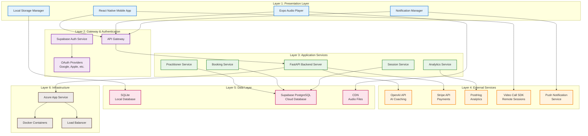

# System Architecture Diagram

## Breath Work Companion App - Layered Architecture

## Architecture Overview

This layered architecture diagram illustrates the Breath Work Companion App's system design following standard enterprise architecture patterns, with clear separation of concerns across six distinct layers:

### Layer 1: Presentation Layer
- **React Native Mobile App**: Cross-platform mobile application providing the user interface
- **Expo Audio Player**: Handles breathing session audio playback and background sounds
- **Notification Manager**: Manages local and push notifications for user engagement
- **Local Storage Manager**: Handles local data persistence and offline functionality

### Layer 2: Gateway & Authentication
- **API Gateway**: Central entry point for all backend communications
- **Supabase Auth Service**: Managed authentication and authorization
- **OAuth Providers**: Third-party authentication (Google, Apple, Facebook, etc.)

### Layer 3: Application Services
- **FastAPI Backend Server**: High-performance API server handling business logic
- **Practitioner Service**: Manages practitioner profiles and availability
- **Booking Service**: Handles appointment scheduling and management
- **Session Service**: Manages breathing sessions and user progress
- **Analytics Service**: Processes user behavior and app performance metrics

### Layer 4: External Services
- **OpenAI API**: Provides AI-powered conversational coaching and personalization
- **Stripe API**: Secure payment processing for practitioner bookings
- **PostHog**: Privacy-focused analytics and user behavior tracking
- **Video Call SDK**: Enables remote practitioner sessions
- **Push Notification Service**: Cross-platform notification delivery

### Layer 5: Data Layer
- **SQLite Local Database**: Client-side storage for personal data and offline functionality
- **Supabase PostgreSQL**: Cloud database for shared data (practitioners, bookings)
- **CDN**: Content delivery network for audio files and static assets

### Layer 6: Infrastructure
- **Azure App Service**: Scalable cloud hosting platform
- **Docker Containers**: Containerized deployment for consistency and portability
- **Load Balancer**: Distributes traffic across multiple service instances

## Key Architectural Principles

1. **Layered Architecture**: Clear separation of concerns across presentation, gateway, service, data, and infrastructure layers
2. **Local-First Privacy**: Core user data and progress stored locally in the presentation layer
3. **API Gateway Pattern**: Centralized entry point for all backend communications and authentication
4. **Microservices Approach**: Modular backend services for scalability and maintainability
5. **Hybrid Cloud Model**: Strategic use of cloud services only where shared data is required
6. **Cross-Platform Efficiency**: React Native + Expo for unified iOS and Android development
7. **Scalable Infrastructure**: Azure App Service with containerization for elastic scaling to 100K+ users

## Data Flow

1. **User Interaction**: Mobile app captures user input in the presentation layer
2. **Authentication**: Gateway layer validates user credentials via Supabase Auth
3. **Business Logic**: Application services layer processes requests and applies business rules
4. **External Integration**: Services layer communicates with external APIs as needed
5. **Data Persistence**: Local SQLite for personal data, cloud PostgreSQL for shared data
6. **Infrastructure**: Containerized services deployed on Azure with load balancing