# System Architecture Diagram

## Breath Work Companion App - Layered Architecture

```mermaid
flowchart TB
    subgraph "📱 Presentation Layer"
        direction LR
        Mobile[React Native Mobile App<br/>• Expo Audio Player<br/>• Notification Manager<br/>• Local Storage Manager]
    end
    
    subgraph "🔐 Authentication & Gateway Layer"
        direction LR
        Gateway[API Gateway] 
        Auth[Supabase Auth<br/>• OAuth Providers<br/>• Session Management]
    end
    
    subgraph "⚙️ Application Services Layer"
        direction LR
        API[FastAPI Backend Server<br/>• Practitioner Service<br/>• Booking Service<br/>• Session Service<br/>• Analytics Service]
    end
    
    subgraph "🌐 External Services Layer"
        direction LR
        OpenAI[OpenAI API<br/>AI Coaching]
        Stripe[Stripe API<br/>Payments]
        PostHog[PostHog<br/>Analytics]
        Video[Video Call SDK<br/>Remote Sessions]
        Push[Push Notifications]
    end
    
    subgraph "💾 Data Layer"
        direction LR
        LocalDB[SQLite<br/>Local Database<br/>• User Progress<br/>• Personal Data]
        CloudDB[Supabase PostgreSQL<br/>Cloud Database<br/>• Practitioners<br/>• Bookings]
        CDN[CDN<br/>Audio Files<br/>• Session Recordings<br/>• Background Sounds]
    end
    
    subgraph "🏗️ Infrastructure Layer"
        direction LR
        Azure[Azure App Service<br/>• Docker Containers<br/>• Load Balancer<br/>• Auto-scaling]
    end
    
    %% Layer connections with cleaner flow
    Mobile -.-> Gateway
    Gateway --> Auth
    Gateway --> API
    
    API --> OpenAI
    API --> Stripe
    API --> PostHog
    API --> Video
    API --> Push
    
    Mobile --> LocalDB
    API --> CloudDB
    Mobile -.-> CDN
    
    API --> Azure
    
    %% Styling for better visual separation
    classDef presentation fill:#e3f2fd,stroke:#1976d2,stroke-width:3px,color:#000
    classDef gateway fill:#f3e5f5,stroke:#7b1fa2,stroke-width:3px,color:#000
    classDef services fill:#e8f5e8,stroke:#388e3c,stroke-width:3px,color:#000
    classDef external fill:#fff3e0,stroke:#f57c00,stroke-width:3px,color:#000
    classDef data fill:#fce4ec,stroke:#c2185b,stroke-width:3px,color:#000
    classDef infrastructure fill:#efebe9,stroke:#5d4037,stroke-width:3px,color:#000
    
    class Mobile presentation
    class Gateway,Auth gateway
    class API services
    class OpenAI,Stripe,PostHog,Video,Push external
    class LocalDB,CloudDB,CDN data
    class Azure infrastructure
```

## Architecture Overview

This layered architecture diagram illustrates the Breath Work Companion App's system design following standard enterprise architecture patterns, with clear separation of concerns across six distinct layers:

### 📱 Presentation Layer
The user-facing mobile application built with React Native and Expo, providing cross-platform compatibility and rich user interactions. Includes integrated audio playback, notification management, and local storage capabilities for offline functionality.

### 🔐 Authentication & Gateway Layer
Central authentication and API gateway services providing secure access control and request routing. Supabase Auth handles user authentication with OAuth provider integration for seamless login experiences.

### ⚙️ Application Services Layer
High-performance FastAPI backend server containing core business logic across specialized microservices for practitioners, bookings, sessions, and analytics. Designed for horizontal scaling and maintainability.

### 🌐 External Services Layer
Third-party integrations providing specialized capabilities including AI-powered coaching (OpenAI), secure payments (Stripe), analytics (PostHog), video calling, and push notifications.

### 💾 Data Layer
Hybrid data storage strategy with local SQLite for privacy-sensitive user data and cloud PostgreSQL for shared resources. CDN provides optimized delivery of audio content and static assets.

### 🏗️ Infrastructure Layer
Azure App Service provides scalable cloud hosting with Docker containerization, load balancing, and auto-scaling capabilities to support growth to 100K+ users.

## Key Architectural Principles

1. **Layered Architecture**: Clear separation of concerns across presentation, gateway, service, data, and infrastructure layers
2. **Local-First Privacy**: Core user data and progress stored locally in the presentation layer
3. **API Gateway Pattern**: Centralized entry point for all backend communications and authentication
4. **Microservices Approach**: Modular backend services for scalability and maintainability
5. **Hybrid Cloud Model**: Strategic use of cloud services only where shared data is required
6. **Cross-Platform Efficiency**: React Native + Expo for unified iOS and Android development
7. **Scalable Infrastructure**: Azure App Service with containerization for elastic scaling to 100K+ users

## Data Flow

The system follows a clear top-down data flow through the layered architecture:

1. **User Interaction**: Mobile app captures user input and displays responses
2. **Gateway Routing**: API Gateway routes requests and validates authentication  
3. **Business Logic**: Application services process requests and apply business rules
4. **External Integration**: Services communicate with third-party APIs for specialized functions
5. **Data Persistence**: Local SQLite for personal data, cloud PostgreSQL for shared data
6. **Infrastructure**: Containerized services on Azure with automatic scaling and load balancing

This architecture ensures data privacy through local-first storage while enabling collaborative features through selective cloud integration.